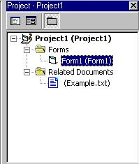



## How to add related documents to your project

### Description

Here is a update for those that does not have Powerpoint. To help you add a doc related to your project. For example, maybe someting like notes about your project.
 
### More Info
 

             |
---                |---
**Submitted On**   |2002-09-29 08:20:02
**By**             |[Brendan R Botha](https://github.com/Planet-Source-Code/PSCIndex/blob/master/ByAuthor/brendan-r-botha.md)
**Level**          |Beginner
**User Rating**    |4.6 (88 globes from 19 users)
**Compatibility**  |VB 5\.0, VB 6\.0
**Category**       |[Miscellaneous](https://github.com/Planet-Source-Code/PSCIndex/blob/master/ByCategory/miscellaneous__1-1.md)
**World**          |[Visual Basic](https://github.com/Planet-Source-Code/PSCIndex/blob/master/ByWorld/visual-basic.md)
**Archive File**   |[How\_to\_add1379709292002\.zip](https://github.com/Planet-Source-Code/brendan-r-botha-how-to-add-related-documents-to-your-project__1-39340/archive/master.zip)

